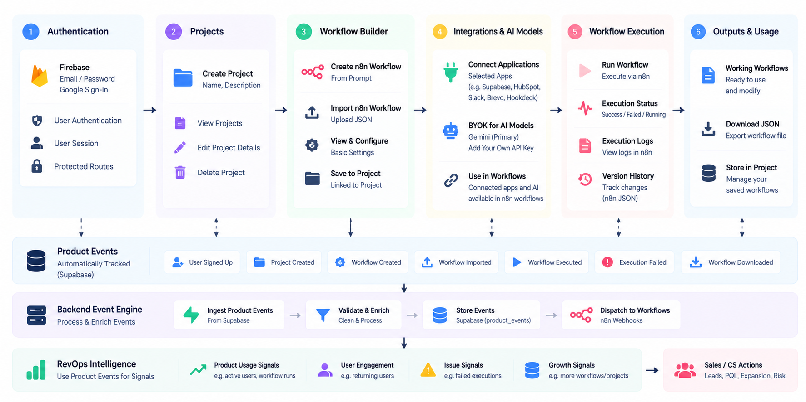

# AgentFlow

Backend intelligence integration is documented in [docs/backend-integration.md](docs/backend-integration.md).

AgentFlow is a modern AI Automation Engineer that transforms natural-language business requirements into validated, production-ready workflow packages.

> **Release status:** Version 1.1.0 — Production Candidate
## 🎥 Demo

[Watch the Loom Demo](https://www.loom.com/share/ce1ee735803b44fdaa64cc0866af9bc5)
>
> PayU is currently integrated in Test Mode for checkout demonstration only. Subscription activation and production payment processing are not enabled.

## Features

- AI-led requirement gathering with a concise, confidence-aware conversation engine
- Automation Blueprint and intelligent tool planning before generation
- Multi-provider AI support for Google Gemini, OpenAI, Anthropic, and DeepSeek
- Bring Your Own Key (BYOK) provider connections with encrypted credential storage
- Persistent conversations and Continue Conversation with full project context
- Internal workflow graph generation, automatic layout, and graph validation
- Deterministic n8n export through a dedicated production exporter
- n8n and Make.com workflow imports with lifecycle analysis
- Independent background artifact generation and per-stage retry behavior
- Project version history, activity timeline, and incremental regeneration
- Architecture review, deployment guide, environment template, and testing checklist
- Focused downloads with one importable `workflow.json`, README, deployment guide, environment template, advanced documentation, and a complete project ZIP
- Conversational workflow diagnosis and targeted, versioned repair using uploaded workflows, Project ZIPs, screenshots, and execution logs
- Firebase Authentication with Supabase persistence and Row Level Security
- Usage analytics and PayU Test checkout integration

# Product Architecture



## How AgentFlow Works

1. **Conversation** — The user describes the automation in plain language.
2. **Requirements** — AgentFlow extracts the business process, trigger, rules, systems, and desired outcomes.
3. **Blueprint** — The application summarizes the proposed automation, complexity, and confidence.
4. **Tool Planning** — Required capabilities, integrations, credentials, and environment placeholders are mapped without collecting secrets.
5. **Artifact Generation** — Validated artifacts are generated independently in the background.
6. **Export Pipeline** — The internal graph is laid out and passed to the deterministic n8n exporter.
7. **Downloads** — Only validated artifacts are exposed as individual files and a project package.
8. **Lifecycle** — Conversations, versions, imports, decisions, and timeline events remain attached to the project.

## Technology Stack

| Area | Technology |
| --- | --- |
| Frontend | Next.js 16, React 19, TypeScript, Tailwind CSS |
| UI | Custom light-first glassmorphism system, Lucide icons |
| Backend | Next.js Route Handlers and server-side services |
| Database | Supabase PostgreSQL with RLS policies |
| Authentication | Firebase Authentication |
| AI providers | Google Gemini, OpenAI, Anthropic, DeepSeek |
| Knowledge pipeline | Document extraction, chunking, embeddings, retrieval, and citations |
| Workflow engine | Typed internal graph, validation, layout, and lifecycle services |
| Export | Deterministic n8n workflow exporter |
| Deployment | Vercel-compatible Next.js deployment |
| Billing | PayU hosted checkout in Test Mode |

## Installation

### Prerequisites

- Node.js 20 or newer
- pnpm 11
- Firebase project with Authentication enabled
- Supabase project with the included migrations applied
- At least one supported AI provider key, connected through the application

### Local setup

```bash
git clone https://github.com/m-irfvnnn/AgentFlow.git
cd AgentFlow
pnpm install
cp .env.example .env.local
pnpm dev
```

Open [http://localhost:3000](http://localhost:3000).

Apply the database migrations to a linked Supabase project before exercising project lifecycle features:

```bash
supabase link --project-ref YOUR_PROJECT_REF
supabase db push
```

## Environment Variables

Copy `.env.example` to `.env.local` and supply values for your environment. Never commit `.env.local` or provider secrets.

### Firebase

- `NEXT_PUBLIC_FIREBASE_API_KEY`
- `NEXT_PUBLIC_FIREBASE_AUTH_DOMAIN`
- `NEXT_PUBLIC_FIREBASE_PROJECT_ID`
- `NEXT_PUBLIC_FIREBASE_STORAGE_BUCKET`
- `NEXT_PUBLIC_FIREBASE_MESSAGING_SENDER_ID`
- `NEXT_PUBLIC_FIREBASE_APP_ID`

### Supabase

- `NEXT_PUBLIC_SUPABASE_URL`
- `NEXT_PUBLIC_SUPABASE_ANON_KEY`

### AI providers

- `GEMINI_MODEL` — default server model identifier
- `GEMINI_ENDPOINT` — server-side Google Generative Language API root ending in `/models`
- Provider API keys are added through Connections and encrypted at rest; they are not public environment variables.
- AgentFlow BYOK connections call each provider directly from server route handlers; they do not pass through the backend-engine LiteLLM service.
- Connection tests return safe categories (`authentication`, `model`, `endpoint`, `rate_limit`, `upstream`, `timeout`, `configuration`, `network`) and diagnostic codes without returning keys or raw provider bodies.

### Production package validation

Production generation persists the workflow, deployment guide, environment manifest, testing checklist, and architecture review independently, then validates the n8n export. Architecture Review combines deterministic graph/error-path checks with a structured AI-assisted review from the selected connected provider. Fenced JSON is accepted; malformed or incomplete structured output fails safely.

Download is enabled only after all required artifacts, Architecture Review, the validated export, and ZIP inputs are ready. A failed Architecture Review can be retried independently; the other completed stages are not regenerated.

### PayU Test Mode

- `PAYU_MERCHANT_KEY`
- `PAYU_MERCHANT_SALT`
- `PAYU_PRO_MONTHLY_AMOUNT`
- `PAYU_TEST_CUSTOMER_PHONE`

### Application

- `APP_URL`
- `CONNECTIONS_ENCRYPTION_KEY`

See [.env.example](.env.example) for safe placeholders and generation guidance.

## Commands

```bash
pnpm dev        # Start the development server
pnpm typecheck  # Run TypeScript validation
pnpm lint       # Run ESLint with zero warnings allowed
pnpm test       # Run the automated test suite
pnpm build      # Create a production Webpack build
pnpm start      # Serve the production build
```

## Project Structure

```text
app/                    Next.js pages, layouts, styles, and API routes
components/             Product UI and state providers
lib/ai/                 Provider clients and conversation intelligence
lib/automation/         Workflow generation, validation, layout, lifecycle, and export
lib/billing/            Billing contracts and PayU Test checkout provider
lib/connections/        Encrypted BYOK connection services
lib/knowledge/          Document parsing, indexing, retrieval, and citations
lib/supabase/           Supabase client, repositories, and generated types
public/                 Brand assets and web manifest
supabase/migrations/    Versioned PostgreSQL schema and RLS migrations
tests/                  Unit and integration-oriented validation tests
types/                  Shared application types
```

## Architecture Overview

The conversation is the source of requirements and project memory. Once the Automation Blueprint and tool plan are confirmed, background jobs generate each artifact independently. The workflow generator emits only the typed internal graph; validation and automatic layout run before persistence. The n8n JSON is produced exclusively by the deterministic exporter. Project downloads include only artifacts that passed their validation stage. Version history and timeline records preserve the project lifecycle for future conversational updates.

## Deployment

1. Configure the environment variables in the hosting platform.
2. Apply all Supabase migrations and verify RLS policies.
3. Configure authorized Firebase domains.
4. Set `APP_URL` to the public application origin.
5. Build with `pnpm build` and deploy the generated Next.js application.
6. Keep PayU pointed at the Test environment until production billing and verification are implemented.

## Contributing

See [CONTRIBUTING.md](CONTRIBUTING.md) for local setup, validation requirements, and pull request guidance.

## Changelog

Release history is documented in [CHANGELOG.md](CHANGELOG.md).

## License

No open-source license is currently included. Unless a license is added by the repository owner, all rights are reserved and the source is provided for viewing and evaluation only.
